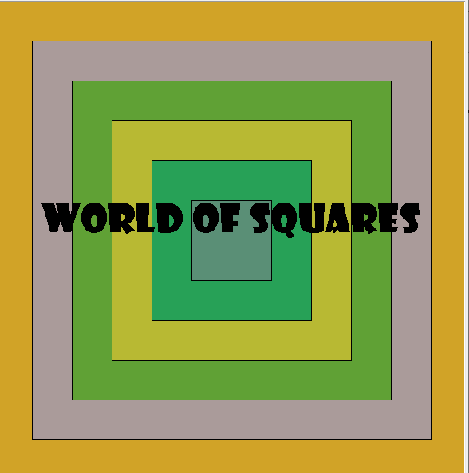
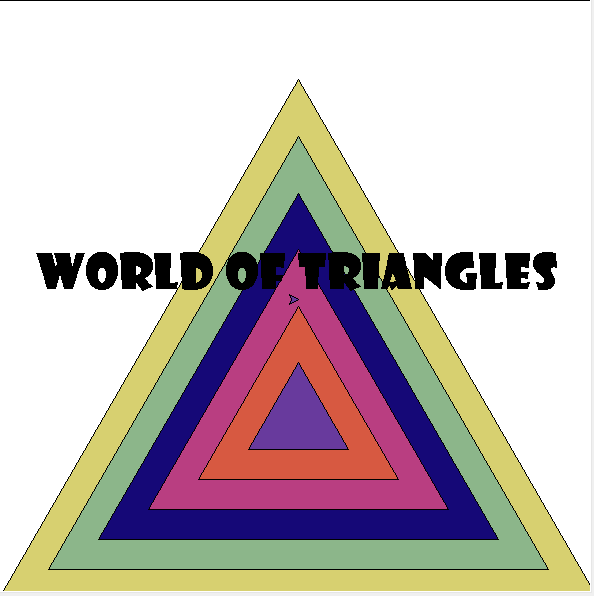

# Drawing-with-turtle

This is a simple animation created using python's turtle built-in functions. When the python file is run, one is immersed into the world of shapes! The turtle draws different shapes(squares, triangles, rectangles and circles) in different random colorsand then erases them. Pictures of the main final outputs can be seen below.

## Running the project

The project is coded in Python 3 and will run as long as you are able to run Python on your machine.

## Project Code
The code uses user defined functions to create the shapes so it is easy to modify the output. Also, the program uses random values to generate colors so that each time the output is different. Lots of comments and meaningful variable names have been used to ensure that the code is easy to follow. 

## Sample Outputs

The major output screens that you will see when you run the python file can be seen below

### Square

After running the code section to generate squares, the final output looks like this:

### Triangles

After running the code section to generate triangles, the final output looks like this:

### Rectangles

After running the code section to generate rectangles, the final output looks like this:

### Circles

After running the code section to generate circles, the final output looks like this:

##Author

